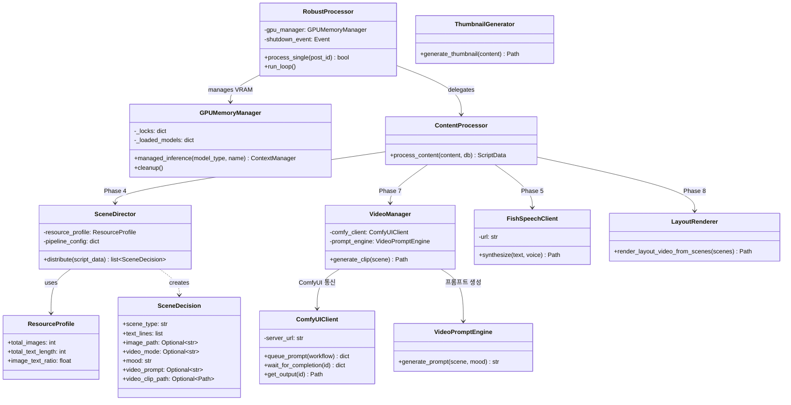

# ai_worker — Mermaid Diagrams

## 1. 모듈 의존성 전체도

> 소스: [01_module_overview.mmd](01_module_overview.mmd)

```mermaid
%%{init: {'theme': 'base', 'themeVariables': {'primaryColor': '#4A90D9', 'primaryTextColor': '#fff', 'primaryBorderColor': '#2E6AB0', 'lineColor': '#555', 'secondaryColor': '#F5A623', 'tertiaryColor': '#7ED321'}}}%%

graph TB
    subgraph ENTRY["Entry Points"]
        main["core/main.py<br/>진입점 · 폴링 루프"]
        processor["core/processor.py<br/>RobustProcessor"]
    end

    subgraph PIPELINE["Pipeline Orchestration"]
        cp["pipeline/content_processor.py<br/>Phase 1~8 통합"]
    end

    subgraph LLM_LAYER["LLM Layer — Phase 2"]
        client["script/client.py<br/>Ollama HTTP"]
        chunker["script/chunker.py<br/>의미 단위 청킹"]
        parser["script/parser.py<br/>JSON 파싱/복구"]
        normalizer_s["script/normalizer.py<br/>댓글 정규화"]
        logger["script/logger.py<br/>LLM 로깅"]
    end

    subgraph SCENE_LAYER["Scene Layer — Phase 1,3,4"]
        analyzer["scene/analyzer.py<br/>ResourceProfile"]
        director["scene/director.py<br/>SceneDirector"]
        strategy["scene/strategy.py<br/>SceneMix"]
        validator["scene/validator.py<br/>max_chars 검증"]
    end

    subgraph TTS_LAYER["TTS Layer — Phase 5"]
        fish["tts/fish_client.py<br/>Fish Speech 1.5"]
        norm_tts["tts/normalizer.py<br/>한국어 정규화"]
        numread["tts/number_reader.py<br/>숫자 읽기"]
    end

    subgraph VIDEO_LAYER["Video Layer — Phase 4.5,6,7"]
        vmgr["video/manager.py<br/>VideoManager"]
        comfy["video/comfy_client.py<br/>ComfyUI 통신"]
        prompt_eng["video/prompt_engine.py<br/>한→영 프롬프트"]
        imgfilter["video/image_filter.py<br/>I2V 적합성"]
        vutils["video/video_utils.py<br/>FFmpeg 후처리"]
    end

    subgraph RENDERER["Renderer — Phase 8"]
        layout["renderer/layout.py<br/>하이브리드 합성"]
        composer["renderer/composer.py<br/>컴포저"]
        frames["renderer/_frames.py<br/>프레임 렌더"]
        tts_r["renderer/_tts.py<br/>TTS 청크"]
        encode["renderer/_encode.py<br/>FFmpeg 인코딩"]
        subtitle["renderer/subtitle.py<br/>ASS 자막"]
        thumb["renderer/thumbnail.py<br/>썸네일"]
    end

    subgraph INFRA["Infrastructure"]
        gpu["core/gpu_manager.py<br/>GPUMemoryManager"]
        shutdown["core/shutdown.py<br/>Graceful Shutdown"]
    end

    subgraph EXTERNAL["External Modules"]
        db["db.models<br/>ScriptData·Post·Content"]
        config["config.settings<br/>설정 허브"]
        analytics["analytics<br/>feedback·ab_test"]
        uploaders["uploaders<br/>YouTube 업로드"]
    end

    main --> processor
    main --> shutdown
    processor --> cp
    processor --> gpu

    cp --> chunker
    cp --> analyzer
    cp --> director
    cp --> validator
    cp --> fish
    cp --> prompt_eng
    cp --> vmgr
    cp --> comfy
    cp --> gpu

    chunker --> analyzer
    client --> parser
    client --> normalizer_s
    client --> logger
    normalizer_s --> numread

    director --> analyzer
    director --> imgfilter
    director --> strategy

    fish --> norm_tts
    norm_tts --> numread

    vmgr --> prompt_eng
    prompt_eng --> client
    prompt_eng --> logger

    layout --> frames
    layout --> tts_r
    layout --> encode
    composer --> layout
    composer --> thumb

    processor --> db
    processor --> config
    processor --> analytics
    processor --> uploaders
    main --> db
    main --> config
    logger --> db
    client --> config
    chunker --> config
    director --> config
    validator --> config
    fish --> config
    layout --> config
    thumb --> config
```

---

## 2. 파이프라인 흐름 (VRAM 2막 구조)

> 소스: [02_pipeline_flow.mmd](02_pipeline_flow.mmd)

```mermaid
%%{init: {'theme': 'base', 'themeVariables': {'primaryColor': '#4A90D9'}}}%%

flowchart LR
    subgraph ACT1["1막 — LLM &#40;qwen2.5:14b ~14GB&#41;"]
        direction TB
        P1["Phase 1<br/>analyze_resources<br/>scene/analyzer.py"]
        P2["Phase 2<br/>chunk_with_llm<br/>script/chunker.py"]
        P3["Phase 3<br/>validate_and_fix<br/>scene/validator.py"]
        P4["Phase 4<br/>SceneDirector<br/>scene/director.py"]
        P1 --> P2 --> P3 --> P4
    end

    VRAM_SWITCH["VRAM 전환<br/>LLM 해제<br/>torch.cuda.empty_cache"]

    subgraph ACT2["2막 — Media &#40;Fish ~5GB + LTX ~12.7GB&#41;"]
        direction TB
        P45["Phase 4.5<br/>assign_video_modes<br/>scene/director.py"]
        P5["Phase 5<br/>TTS 생성<br/>tts/fish_client.py"]
        P6["Phase 6<br/>video_prompt 생성<br/>video/prompt_engine.py"]
        P7["Phase 7<br/>video_clip 생성<br/>video/manager.py<br/>+ comfy_client.py"]
        P8["Phase 8<br/>FFmpeg 렌더링<br/>renderer/layout.py"]
        P45 --> P5 --> P6 --> P7 --> P8
    end

    ACT1 --> VRAM_SWITCH --> ACT2

    style ACT1 fill:#FFF3CD,stroke:#F5A623,stroke-width:2px
    style ACT2 fill:#D4EDDA,stroke:#28A745,stroke-width:2px
    style VRAM_SWITCH fill:#F8D7DA,stroke:#DC3545,stroke-width:2px,color:#721c24
```

---

## 3. 클래스 다이어그램

> 소스: [03_class_diagram.mmd](03_class_diagram.mmd)

